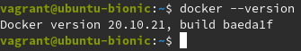

# Steps to deploy a Docker Swarm locally

# Index

#### 1. [Install Virtual Machines](#installvm)  
#### 2. [Create a Docker Swarm](#createSwarm)  


<a name="installvm"></a>
# Install Virtual Machines

Here I have created three virtual machines using vagrant.  
The folder structure is as follows:  


_I will refer to folder now as a node_  
Now inside a node create a VagrantFile and copy paste the contents from this [file](https://raw.githubusercontent.com/yashkathe/Docker-Swarm-with-Vagrant/master/Vagrantfile).

```bash
touch Vagrantfile
```

Now execute the following commands to start a node.

```bash
vagrant up
vagrant up
vagrant ssh
```

Update and Upgrade your node after you have successfully SSHed into it 

```bash
sudo apt update && sudo apt upgrade
```

Check if docker is installed

```bash
docker --version
```



Also change the name of the node by editing the following file so that they will be distinguishable from each other.
```bash
sudo vim /etc/hostname
``` 
Now reboot and ssh back in.    

_Repeat the steps for other two nodes_

<a name="createSwarm"></a>
# Create Docker Swarm